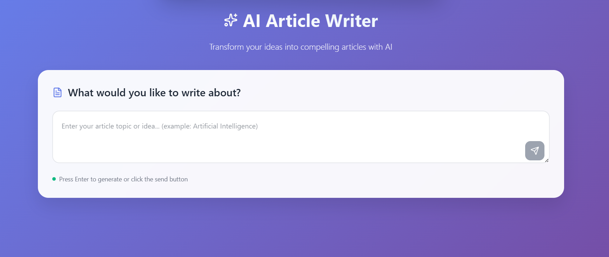
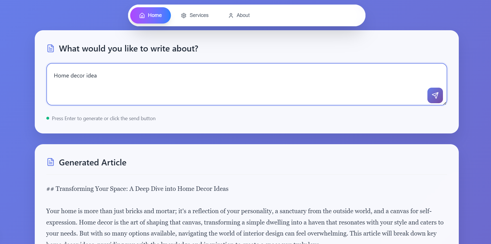

# Ai Article writer
AI-powered article writer. You insert topic name, ai generate the article. Here I have use gemini-2.0-flash model you can change and add yours.


## ✨ Features

- 🎨 **Modern UI** - Nav menu and prompt box to insert topic
- 🤖 **AI Generate** - Powered by Google's Gemini 2.0 Flash model
- 📱 **Responsive Design** - Works seamlessly on desktop and mobile
- ⚡ **Real-time Feedback** - Loading animations till show generated article

## 📋 Prerequisites

- Python 3.8 or higher
- Google AI API key (Gemini)

## 🛠️ Installation

1. **Clone the repository**
   ```bash
   git clone https://github.com/shohagcsediu/ai-article-writer.git
   cd ai-article-writer
   cd backend (for backend directory)
   cd frontend (for frontend directory)
   ```

2. **Create a virtual environment**
   ```bash
   python -m venv venv
   source venv/bin/activate  # On Windows: venv\Scripts\activate
   ```

3. **Install dependencies**
   for backend directory use this command
   ```bash
   pip install -r requirements.txt
   ```
   for frontend use this command
   ```bash
   npm install
   ```

5. **Set up environment variables**
   
   Create a `.env` file in the backend directory:
   ```env
   GOOGLE_API_KEY=your_gemini_api_key_here
   PORT=5000
   ```

6. **Get your Gemini API key**
   - Visit [Google AI Studio](https://makersuite.google.com/app/apikey)
   - Create a new API key
   - Add it to your `.env` file

## 🏃‍♂️ Running the Application

### Backend
```bash
python app.py
```
### Frontend
```bash
npm run dev
```
The backend will be available at `http://localhost:5000` and frontend will be at `http://localhost:3000/`

## 📸 Screenshots

### Main Interface

*Topic insert in prompt*

### Article generate

*AI-generated article loaded bellow the prompt box*

## 📞 Support
If you encounter any issues or have questions:

1. Check the [Issues](https://github.com/shohagcsediu/ai-article-writer/issues) page
2. Create a new issue with detailed information
3. Include error messages and steps to reproduce

---

⭐ **Star this repository if you found it helpful!**

Made with ❤️ by [Shohag](https://github.com/shohagcsediu)
